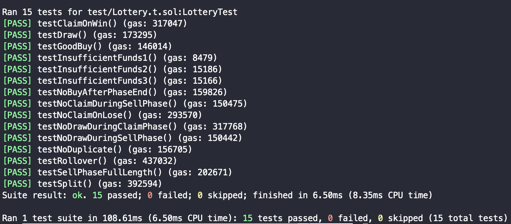

## 주어진 interface 및 test code 분석

- setUp
    
    address 1, 2, 3에게 각각 100 ether 제공
    
- testGoodBuy
    
    0.1 ether로 buy를 할 수 있는지 확인
    
- testInsufficientFunds1, 2, 3
    
    0, 0.1 ether - 1, 0.1 ether + 1로 buy를 했을 때 revert가 나는지 확인
    

- testNoDuplicate
    
    0.1로 buy 후 같은 msg.sender로 다시 buy시 revert나는지 확인
    
- testSellPhaseFullLength
    
    0.1로 buy 후 24시간-1초 뒤 address 1에서 0.1로 buy할 수 있는지 확인
    

- testNoBuyAfterPhaseEnd
    
    0.1로 buy 후 24시간 뒤 address 1에서 0.1로 buy 시 revert나는지 확인
    
    (SellPhase가 24시간이고 SellPhase가 끝나면 buy를 못함)
    

- testNoDrawDuringSellPhase, testNoClaimDuringSellPhase
    
    0.1로 buy 후 24시간-1초 뒤 각각 draw, claim 시 revert나는지 확인
    
    (SellPhase 동안에는 draw, claim을 못함)
    

- testDraw
    
    24시간 후에는 draw할 수 있는지 확인
    
- getNextWinningNumber
    
    vm.snapshot으로 0.1로 buy, 24시간 뒤로 워프, draw 후 초기 상태로 revert시키고 winningNumber을 return한다.
    
    (test만을 위한 용도인 것 같다.)
    
- testClaimOnWin
    
    winningNumber로 buy 후 24시간 후로 워프, draw → claim한 뒤`received_msg_value`가 `expectedPayout` 와 같아지는지 확인
    

- testNoClaimOnLose
    
    winningNumber을 일부러 틀리게 줘서 claim이 실패하는지 확인
    
- testNoDrawDuringClaimPhase
    
    claim하는 동안에는 draw를 할 수 없음을 확인
    
    (본 과제에서는 claim phase time이 따로 없기 때문에 `claim하는 동안` 은 draw한 뒤, 다음 buy를 할 때까지로 정의했다.)
    

- testRollover
    
    처음엔 틀리게, 그 다음은 맞게 buy하여 claim했을 때, 합친 value를 얻는지 확인
    
- testSplit
    
    당첨자가 2명인 경우, 총 상금이 절반씩 분배되는지 확인
    

## 구현

### 전역 변수, 구조체

```solidity
struct buyer {
    uint16 guess;
    bool isbuyer;
}

uint16 public winningNumber;
uint public totalbuy;
uint public SellPhaseTime;
bool public isSellPhase;
bool public isClaimPhase;
uint public buyerCount;
uint public winners;

mapping(uint => address) public matchbuyer;
mapping(address => buyer) public buyers;
```

- buyer
    - guess - 번호
    - isbuyer - buy를 했는지
- winningNumber - 당첨 번호
- totalbuy - 총 모인 금액
- SellPhaseTime - buy가 시작된 시간
- isSellPhase - sell phase인지 확인하는 변수
- isClaimPhase - claim phase인지 확인하는 변수 (claim phase는 draw할 때부터 다음 buy를 할 때까지)
- buyerCount - 구매자 수
- winners - 당첨자 수
- matchbuyer - index로 buyer 매핑
- buyers - msg.sender와 buyer구조체 매핑

### buy

```solidity
function buy(uint16 guess) public payable {
    require(msg.value == 0.1 ether, "wrong value");
    require(buyers[msg.sender].isbuyer == false, "no duplicate");

    if (isSellPhase == false) {
        SellPhaseTime = block.timestamp; // sell phase start
        isSellPhase = true;
    }
    require(block.timestamp - SellPhaseTime < 24 hours, "sell phase end");

    if (isClaimPhase) {isClaimPhase = false;}

    totalbuy += msg.value;
    buyers[msg.sender].guess = guess;
    buyers[msg.sender].isbuyer = true;
    matchbuyer[buyerCount] = msg.sender;
    buyerCount++;
}
```

- 0.1ether로만 buy가능
- 이미 buy를 한 경우(isbuyer가 true), revert
- SellPhase가 false인 경우(처음 buy하는 경우 혹은 claim이 끝난 경우), true로 바꾸고 SellPhaseTime시작
- sell phase는 24시간동안 유지
- claim phase에 정의에 따라 buy함수 내에서 true인 경우 false로 바꿈(claim phase를 buy함수 내에서 끝냄)
- 총 구매 금액, buyers매핑, matchbuyer매핑, 구매자 수 update

### draw

```solidity
function draw() public {
    require(block.timestamp - SellPhaseTime >= 24 hours, "no draw during sell phase");
    require(!isClaimPhase, "now is claim phase");

    winningNumber = uint16(uint256(keccak256(abi.encode(winningNumber)))); // weak random

    for(uint i = 0; i < buyerCount; i++) {
        if (buyers[matchbuyer[i]].guess == winningNumber) {winners++;}
    }

    isSellPhase = false;
    isClaimPhase = true;
}
```

- sell phase인지 확인
- claim phase인지 확인(중복 draw방지)
- winningNumber결정
- buyers매핑 순회하며 당첨자 수 확인
- sell phase끝, claim phase 시작

### claim

```solidity
function claim() public {
    require(block.timestamp - SellPhaseTime >= 24 hours, "no draw during sell phase");

    if (buyers[msg.sender].guess == winningNumber) {
        msg.sender.call{value: totalbuy / winners}("");
        totalbuy -= (totalbuy / winners);
        winners--;
    }
    if (winners == 0) {init();}
}

function init() public {
    for(uint i = 0; i < buyerCount; i++) {
        buyers[matchbuyer[i]].guess = 0;
        buyers[matchbuyer[i]].isbuyer = false;
        matchbuyer[i] = address(0);
    }

    winners = 0;
    buyerCount = 0;        
}
```

- sell phase인지 확인
- 당첨자인 경우, 총 구매 금액의 1/n (n은 당첨자 수) 전송
- 당첨금 모두 지급한 경우, init함수 실행 → buyers매핑, matchbuyer매핑 초기화
- 당첨자 수, 구매자 수 초기화

### 더 고려할 사항들

- claim phase에 당첨자가 모두 claim을 해야 다음 phase로 넘어갈 수 있다. 악의적인 당첨자가 claim을 하지 않는 경우를 방지하려면 claim phase deadline을 만들어서 그 기간동안 당첨자가 claim하지 않을 경우, 자동으로 다음 phase로 넘어가게 할 수 있다.
- 본 과제에서는 winningNumber을 update할 때, 이전 winningNumber을 해시하는 매우 단순한 random을 사용했다. solidity에서는 true random을 생성하기 매우 어렵지만 blockhash, block.timestamp, block.difficulty 등으로 randomness를 강화할 수 있다.

### 결과

